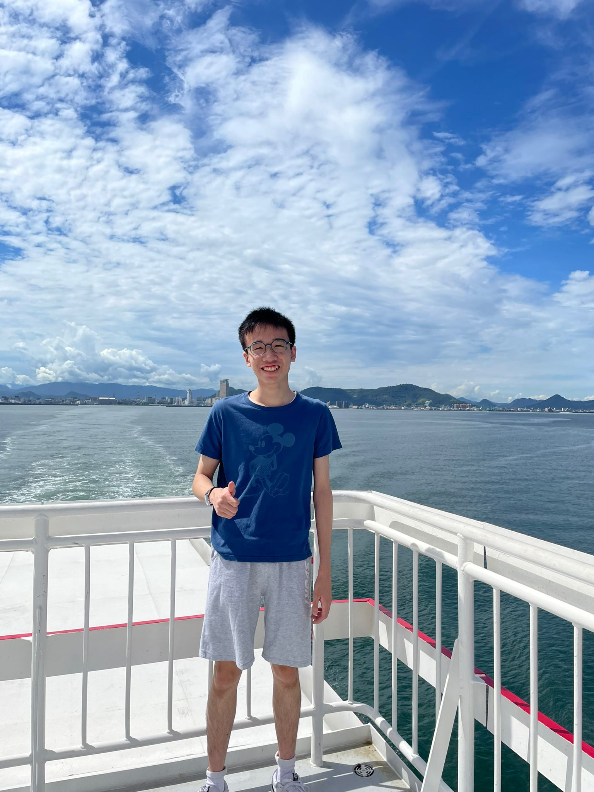

<head>
  <meta name="google-site-verification" content="0SEcurk_dKLeFfJ4VC6azCpxCccwgnd3JkByYOdYncA" />
</head>

Hi, I am Joshua CHOI Kui-Wang 蔡居宏, a Computer Science undergraduate student at CityUHK. 
I am highly interested in the design and analysis of algorithms across various topics.        

# EDUCATION
- B.Sc. Computer Science, City University of Hong Kong, Hong Kong (Sep 2024 - Jun 2028 (Anticipated Graduation Date))
  * Dean's List ×3
  * Competitive Programming School Team Captain
  * Golden Key Club Member
- Sing Yin Secondary School, Hong Kong (Sep 2018 - May 2024)
  * 2023/24 1st in Mathematics (Extended Part - Module 1)
  * Competitive Programming School Team Member
  * Table Tennis School Team Member

# RESEARCH EXPERIENCE
- Undergraduate Research Student, Prof. Minming Li's Group, Department of Computer Science, CityU, Hong Kong (Jul 2025 - Present)
  * Supervised by [Prof. Minming Li](https://www.cs.cityu.edu.hk/~minmli/)
  * Research Keywords: Resource Allocation, Fair Division, Algorithmic Game Theory
- Visiting Scholar, DIMACS REU, Rutgers University, New Jersey, United States (May 2026 - Jul 2026)
  * Supervised by [Prof. Arpita Biswas](https://sites.google.com/view/arpitabiswas) and [Prof. Lirong Xia](https://people.cs.rutgers.edu/~lirong.xia/)
  * Research Topic: Strategic Fair Division
  * Research Keywords: Envy-freeness, Fair Allocation, Mechanism Design
- Summer Research Internship, Bright Future Engineering Talent Hub, College of Engineering, CityU, Hong Kong (Mar 2024 - Jul 2024)
  * Supervised by [Prof. Jing Liao](https://scholars.cityu.edu.hk/en/persons/jingliao/)
  * Research Topic: AI Painting
  * Learnt and researched about state-of-the-art image and video generation models
  * Had hands-on experience with LoRA and Stable Diffusion
  * Produced a 30-second, entirely AI-generated video along with video editing techniques

# WORK EXPERIENCE
- Research Intern, Huawei Hong Kong Research Center, Hong Kong (Aug 2026 - May 2027)
  * Optimization and Control Theory Team, Theory Lab, Leibniz Research Center, 2012 Labs
- Research Assistant, School of Law, CityU, Hong Kong (Jun 2025 - Jun 2026)
  * Supervised by [Prof. Martin Lai](https://www.cityu.edu.hk/slw/about-the-school/our-people/professor/professor-lai-sin-chit-martin)
  * Designed an interactive game simulating collusive pricing behavior based on good software design practices
  *	Developed a Windows application in C# through the Spiral Development Lifecycle
  *	Used by 16 participants in the course LW6161E
  * Implemented TCP/IP networking framework to enable multi-user gameplay
- Intern (Data & Analytics), Research Grants and Contracts Office, CityU, Hong Kong (Sep 2025 - Jun 2026)
  * Provided data analytics support for evaluating and enhancing CityU’s institutional research performance
  * Analyzed over 30 datasets, with over 1000 records
  * Produced 20 visualizations to facilitate data analysis
- PALSI Leader (MA1200 - Calculus and Basic Linear Algebra I), Talent and Education Development Office, CityU, Hong Kong (Sep 2025 - Dec 2025)
  * Nominated by the Department of Mathematics
  * Tutored 8 students on the course MA1200 - Calculus and Basic Linear Algebra I

# PUBLICATIONS
- **Kui-Wang Choi** and Minming Li (2026) _Temporal Fair Division of Indivisible Goods with Structured Constraints_. International Symposium on Algorithmic Game Theory 2026 [[arXiv](https://arxiv.org/abs/2607.17224)]

# PREPRINTS & NOTES
- **Kui-Wang Choi**, Minming Li, Nicholas Teh (2026) _Temporal Fair Division of Indivisible Mixed Manna: Tractable Settings_ [[arXiv](https://arxiv.org/abs/2608.20033)]
- **Kui-Wang Choi** (2026) _Verification of Stochastic Dominance Envy-Freeness in Time Proportional to Input Size_ [[arXiv](https://arxiv.org/abs/2606.16816)]
- **Kui-Wang Choi** and Minming Li (2026) _Temporal Fair Division of Indivisible Goods with Scheduling_ [[arXiv](https://arxiv.org/abs/2601.12835)]

# SCHOLARSHIPS
- Bright Future Whole Person Development Scholarship 2025/2026, HKD 181,000
- Lee Shau Kee Scholarships for Academic Outstanding Students 2025/2026, HKD 25,000
- HKSAR Government Scholarship Fund (Non-Academic Awards) – Talent Development Scholarship 2024/2025, HKD 10,000

# SELECTED ACHIEVEMENTS
In chronological order
- 2026 ICPC National Invitation Tournament (Shenzhen) - Bronze Medal (Apr 2026)
- IEEEXtreme 19.0 Programming Competition - Hong Kong Champion (Oct 2025)

[Full List of My Achievements](https://joshuasyss.github.io/misc/Achievements)

# SELECTED PROJECTS
In lexicographical order
- [CAVS: Consensus-based AI Verification System](https://www.kaggle.com/code/kuiwangchoi/cavs-consensus-based-ai-verification-system) (Jan 2026 - Apr 2026)
  * Led a 6‑person team to build a copyright verification prototype for AIGC images.
  * Designed a consensus algorithm using Python with 3 LLM judges (Stable Diffusion, OpenJourney, Segmind Tiny SD), achieving 70% agreement with copyrightable prompts
- [Decent Traveling Salesman Problem Solver (DTSP)](https://github.com/joshuaSYSS/DTSP) (Oct 2026)
  * Used PyTorch to train a model for solving symmetric TSP efficiently and accurately.
  * Obtained an average gap of 3.36% in TSPLIB benchmarks with not more than 100 cities.
- [Hong Kong Weather ETL Pipeline](https://hk-observator-weather-etl-pipeline.streamlit.app/) (May 2026 - Jun 2026)
  * Assembled an Extract-Transform-Load pipeline from the Hong Kong Observatory API using Python, SQL, Pandas, Docker, and Streamlit
  * Visualized and displayed temperatures using an interactive map for 25+ locations in Hong Kong
  * Ensured 100% schema consistency by automating the pipeline for the database each run

[Full List of My Projects](https://joshuasyss.github.io/misc/Projects)

# COMMUNITY SERVICES
- Founder & Lead Researcher, Social Logic, Hong Kong (Mar 2026 - Present)
  * An independent computational research initiative leveraging Algorithmic Game Theory and Mechanism Design to analyze and optimize Hong Kong’s socio-economic frameworks
  * [Visit our website](https://social-logic.github.io/)
- Hong Kong Joint Collegiate Programming Contest 2026 Problem Setter (Problem K) (Aug 2026)
- Osijek Competitive Programming Camp Summer 2026 Helper (Aug 2026)
- HKSC Database Mini Competition Logistics Volunteer (Apr 2026)

# CERTIFICATES & PROGRAMS
- Leadership Horizons Programme 2025-26 by LinkedIn Learning (Apr 2026 - July 2026)
- Deloitte Australia Data Analytics Job Simulation, Forage (Mar 2026)
- Datacom Software Development Job Simulation, Forage (Feb 2026)
- MATLAB Programming Skills, MathWorks (Nov 2025)
- Google Data Analytics Professional Certificate, Coursera (Aug 2025)

# AFFILIATED WEBSITES
- [Github.com/joshuaSYSS](https://github.com/joshuaSYSS)
- [LinkedIn.com/in/choikuiwang](https://www.linkedin.com/in/choikuiwang)
- [Google Scholar](https://scholar.google.com/citations?user=nqT6bzsAAAAJ)

# PERSONAL INFORMATION
## Where Am I?
Hong Kong

## Language
- Cantonese: Native
- English: Working Proficiency (IELTS 7.5 in Dec 2023)
- Mandarin: Working Proficiency

## Contact Information
Email in hex: [6B 75 69 77 63 68 6F 69 32 2D 63 40 6D 79 2E 63 69 74 79 75 2E 65 64 75 2E 68 6B](https://hexadecimal-to-ascii.infinityfreeapp.com) 

## Misc
ORCID: [0009-0009-8723-0223](https://orcid.org/0009-0009-8723-0223)
